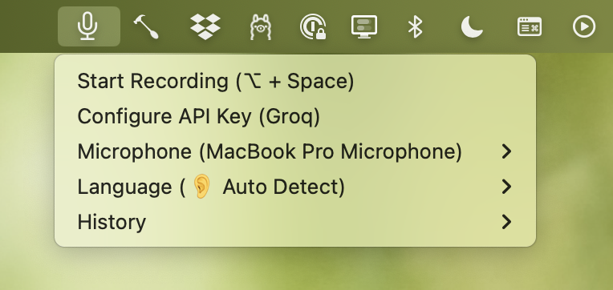

# 🎤 WhisperSpoon: STT Shortcut for macOS

## Screenshot

## Features

- **🗣 Voice Typing:** Speech to text anywhere on macOS.
- **💻 Shortcut:** `⌥ + Space` to start and finish.
- **🎤 Mic Selector:** Submenu for convenient microphone selection.
- **🤖 API Providers:** Supports multiple API providers.
- **💰 Free:** Completely when paired with Elevenlabs Scribe.
- **💕 Open Source:** [MIT Licensed](LICENSE)

## Installation

1. Install https://brew.sh
2. `$ brew install sox switchaudio-osx`
3. Install https://www.hammerspoon.org (`$ brew install --cask hammerspoon`)
4. Start Hammerspoon and grant it accessibility access in settings
5. Copy `whisper-spoon.lua` contents into your `~/.hammerspoon/init.lua`
6. Reload Hammerspoon Config

## API Provider Setup

These API providers are currently supported:

1. https://elevenlabs.io (free for low volumes)
2. https://console.groq.com
3. https://platform.openai.com

Get an API key and paste it in to get going.

## 💸 Paid Alternatives

Whisper Spoon aims to be a completely free, lightweight, and open source alternative to paid solutions like:

- https://superwhisper.com
- https://goodsnooze.gumroad.com/l/macwhisper

## 💕 Contribute

Merge requests are welcome!
